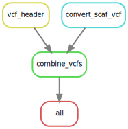

# SNPs to vcf

Proof of concept for converting a `tsv` file with SNPs generated with `halSnps` into a `vcf` file.

To run the demo, start the snakemake pipeline:

```sh
snakemake -c 1
```

This will convert the two data files (`data/hap_1_id1.tsv` and `data/hap_2_id1.tsv`) into a single `vcf` file.




The main work is happening within the `R` script `R/snps_to_vcf.R`, which requires the package [{tidyverse}](https://tidyverse.tidyverse.org/) to be installed.

```R
# R: Install from CRAN
install.packages("tidyverse")
```

The expected output should appear within the new directory `results`:

```
results/
└── vcf
    ├── genotpyes.vcf.gz
    └── header.vcf
```